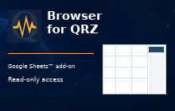
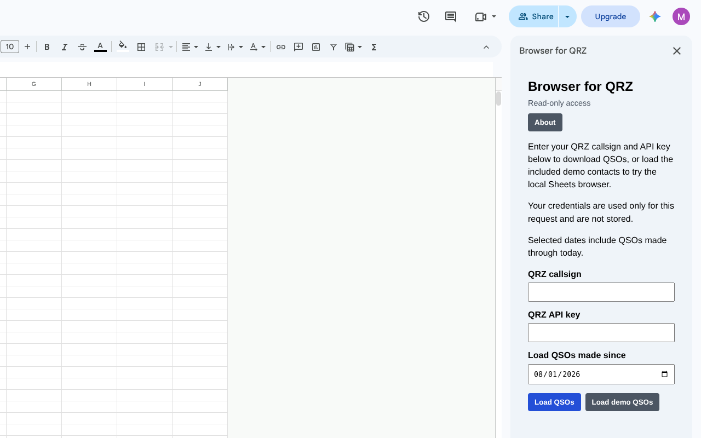
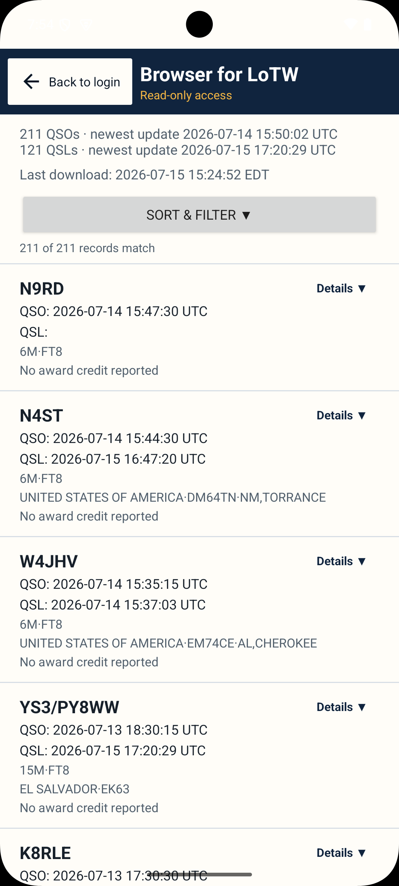
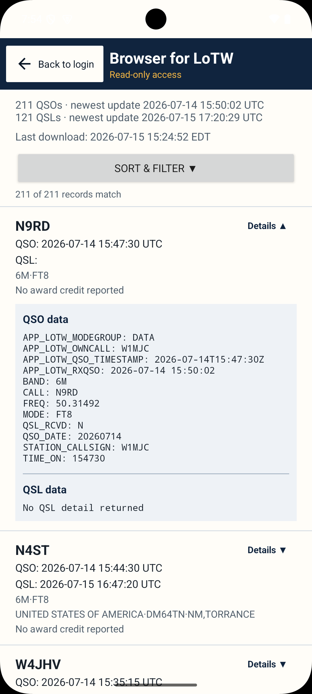
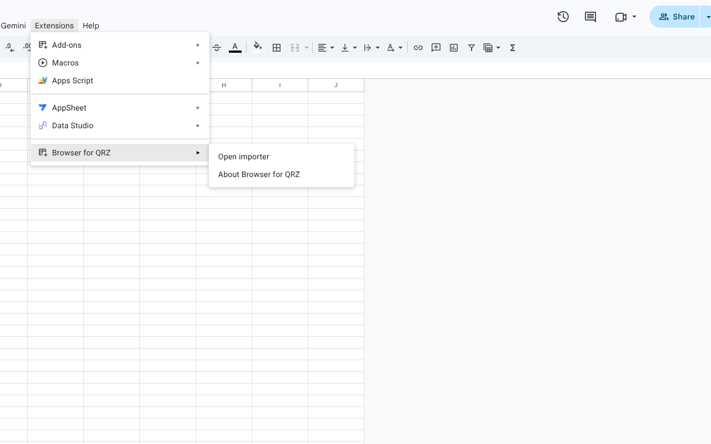

# Browser for QRZ for Google Sheets™

**Status:** 🟢 Production — version `2026.08.14-1`

## Google Workspace Marketplace

Available now on Google Workspace Marketplace.

[Get it on Google Workspace Marketplace](https://workspace.google.com/marketplace/app/browser_for_qrz/264845665339)

## Overview

Browser for QRZ is a read-only Google Sheets™ add-on for browsing QRZ Logbook
QSO and QSL data. Download a selected date range into a spreadsheet, then use
familiar Google Sheets sorting, filtering, search, and charting tools locally.

Your QRZ callsign and API key are used only for a live QRZ request and are not
retained by the add-on. Included demo contacts let operators explore the
add-on without QRZ credentials.

## Features

- Download QRZ Logbook QSO and QSL data into Google Sheets™
- Browse, sort, filter, search, and chart downloaded contacts
- Inspect complete QSO and QSL ADIF fields
- Check a downloaded date range for QRZ Logbook updates
- Use included demo data without QRZ credentials
- Language selection: English, French, German, Italian, Portuguese, and Spanish

## Screenshots

  
  
  
  

## Repository Purpose

This public repository is maintained for Browser for QRZ for Google Sheets™
documentation, release notes, and issue tracking. It does not contain the
add-on source code.

## Documentation

Additional documentation is available in the [docs](docs/) directory.

- [Release Notes](docs/release-notes.md)
- [Google Workspace Marketplace](https://workspace.google.com/marketplace/app/browser_for_qrz/264845665339)
- [Product Page](https://champagne.engineering/browser-for-qrz-sheets)
- [Privacy Policy](https://champagne.engineering/privacy)
- [Terms of Service](https://champagne.engineering/tos)

## Support

Website: https://champagne.engineering

Email: support@champagne.engineering

## Copyright and Disclaimer

© 2026 Champagne Engineering, LLC.

Browser for QRZ is an independent application developed under the CE Widgets
brand by Champagne Engineering, LLC. It is not affiliated with, endorsed by,
or sponsored by QRZ.com.

“QRZ” and “QRZ.COM” are trademarks of QRZ LLC, used solely to describe
compatibility with the QRZ Logbook service.

Google Sheets™ is a trademark of Google LLC.
